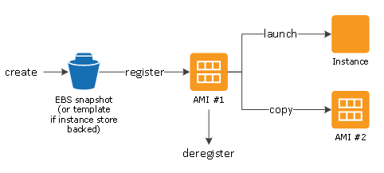
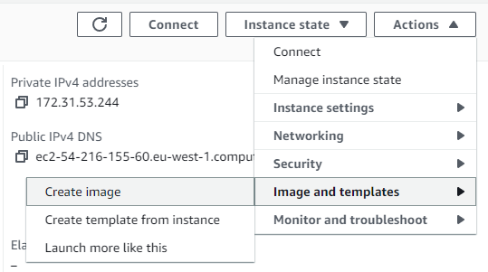
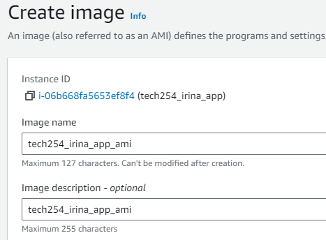
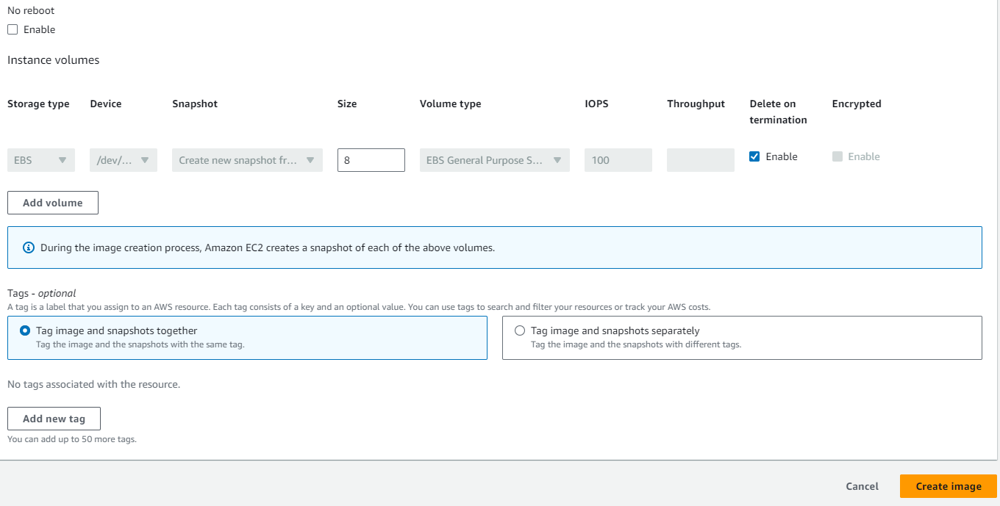

# Amazon Machine Image

#### Useful Resource on AMI: [Amazon Machine Images (AMI)](https://docs.aws.amazon.com/AWSEC2/latest/UserGuide/AMIs.html)

 

* An Amazon Machine Image (AMI) is a supported and maintained image provided by AWS that provides the information required to launch **an instance**. 
* You must **specify an AMI** when you launch an instance. 
* You can launch multiple instances from a single AMI when you require multiple instances with the same configuration. 
* You can use different AMIs to launch instances when you require instances with different configurations.

 

### Create your own AMI
You can launch an instance from an existing AMI, customize the instance (for example, install software on the instance), and then **save this updated configuration as a custom AMI**. Instances launched from this new custom AMI include the customizations that you made when you created the AMI.

 

### AMI Lifecycle: 

// create own diagram when there's time

 

### Steps for Creating an AMI: 

You go to the Instance you want to copy and press Instance State - Image and templates - Create image:

 

Choose an appropriate name for your AMI: 

 

 

### AMI vs Script

Why AMI:
- Stable, Consistent
- Copy to different Regions (eg Irelant to SE Asia)
- Faster to Launch
- Security / Compliance - easier for the company to make sure everything confirms is regulations
- Autoscaling - Automation (eg: Launch 4 different Instances with the same configuration)

Why Script:
- more flexible
- automation
- cost control - AMI will cost to run
- Dynamic Requirements
- Version control easier than with AMI

! AMI usually work together with Scripts.
