## Steps for creating a new EC2 Instance and Deploying nginx WebServer

### 1. Logging in and going to EC2 page
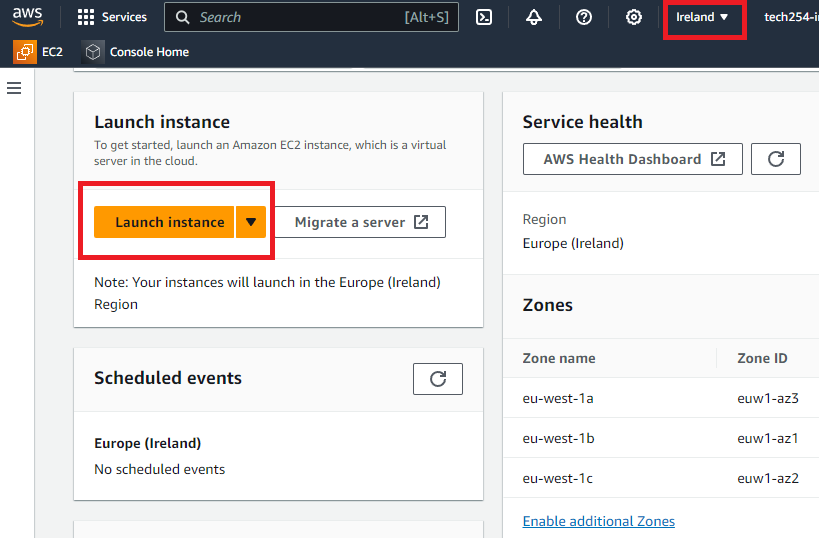

- You will find the *'Launch Instance'* button on the EC2 page. Click on that.
- Always good to make sure you are connected to the correct AWS region (in our case, **Ireland**).

 

### 2. Naming your Instance

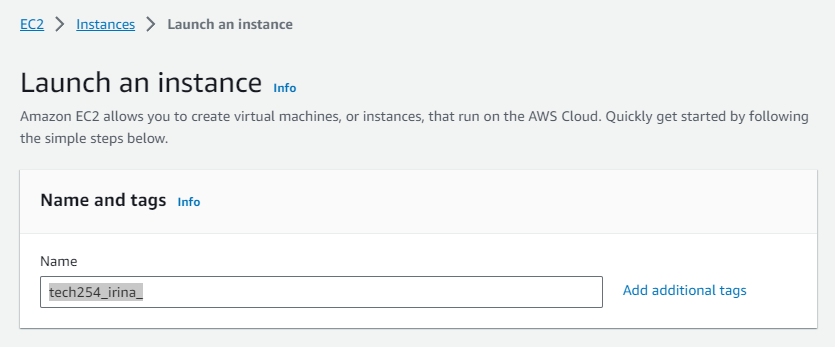

- Make sure that you choose an appropriate name for your Instance (in our case, will always start with *'tech254_name'*)

 

### 3. Choose your AMI (Amazon Machine Image)
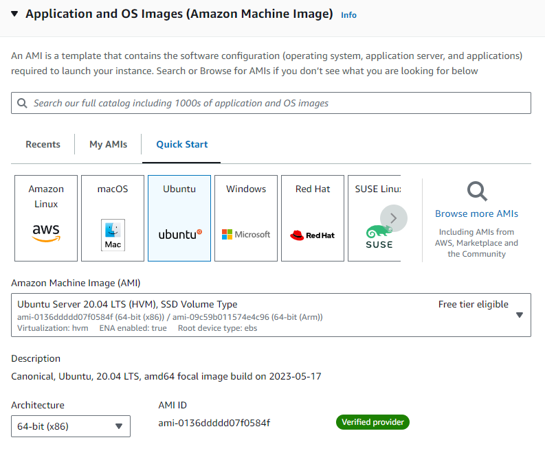

- The AMI is essentially the operating system the virtual machine will use. 
- Make sure to choose one that is appropriate to your needs (in our case, **Ubuntu 20.04 LTS**). 

 

### 4. Choose your Instance Type
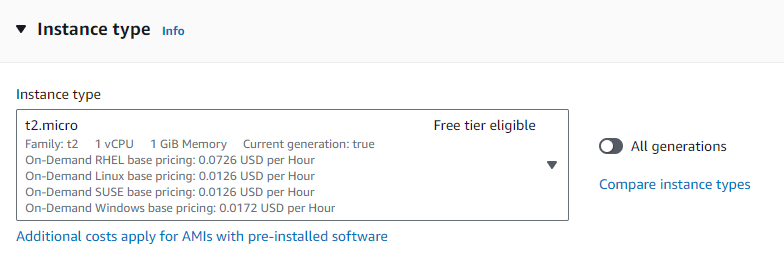

- This option lets you choose your CPU and RAM.
- Make sure you only choose what resources you need (in our case, **t2.micro**).

 

### 5. Choose your Key Pair Login
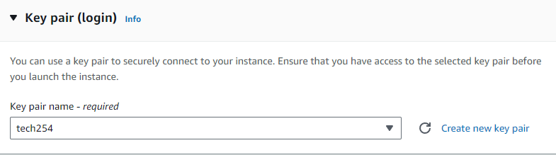

- This lets you choose your security key. 
- Make sure you choose the correct one and have access to it (in our case, **tech254**).

 

### 6. Network Settings
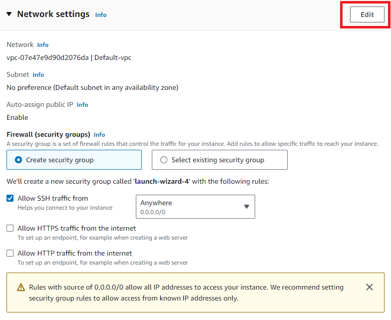

- Press Edit on the Network Settings tab to change your Security Group settings.

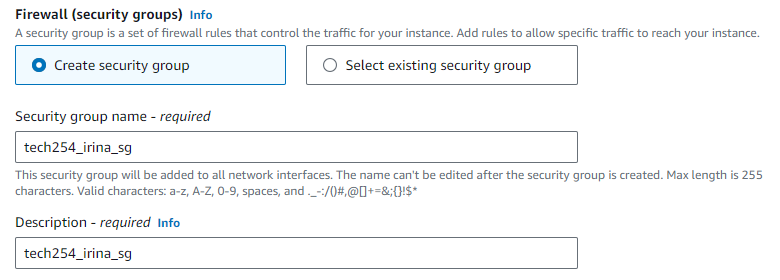

- Choose an appropriate name for your Security Group and add a description.

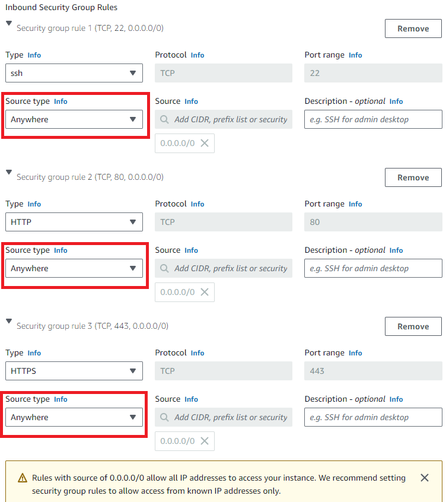

- Here you will add all the Security Group Types you need (in our case, **ssh, HTTP and HTTPS**). 
- The Protocol and Port Range will be automatically entered as well (SSH: 22, HTTP: 80, HTTPS: 443). 
- Make sure to choose the correct Source type - *what IPs you want to have access* (In our case, from **Anywhere**).

 

### 7. Storage
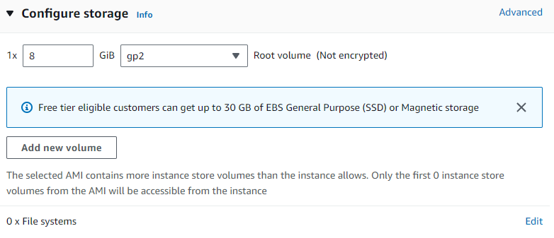

- Next, choose what storage you need (in our case, **8GB** is enough).

 

### 7. Summary
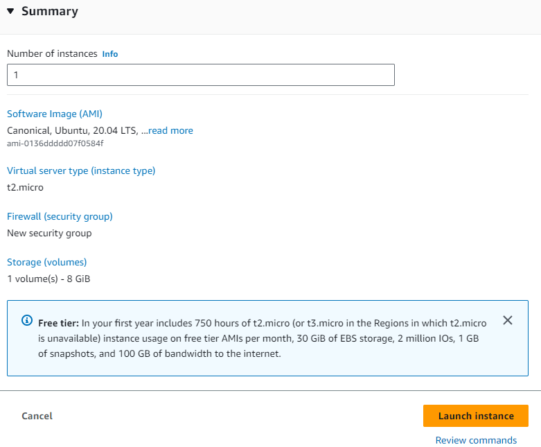

- Once you read the Summary and made sure all details are correct, press *Launch Instance*.

 

### 8. Open Git Bash (as Administrator)
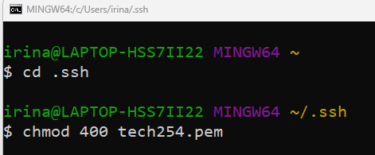

- Make sure you are in the right folder: `cd .ssh`
- Enter your key `chmod 400 tech254.pem` - This will ensure the key is not publicly viewable. 

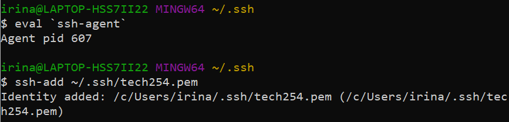

- This will add the ssh key.

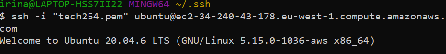

- `ssh -i "tech254.pem" 'PUBLIC DNS ADDRESS` 
- This will connect to your instance using its Public DNS address.

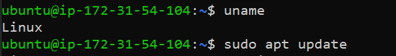

- `sudo apt update` will list all the Updates available.
- Next, enter `sudo apt upgrade -y`. This will apply all the updates available.
- Entering `-y` will make sure any messages it receives will be answered with 'yes'.

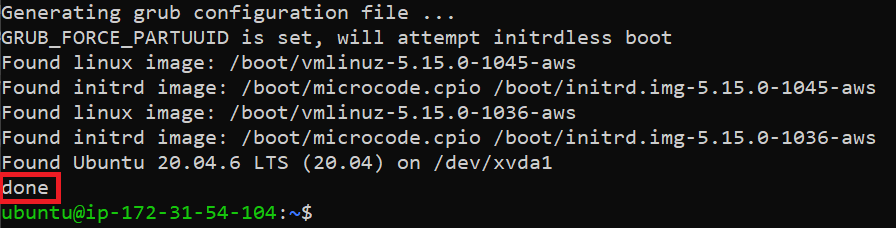

- Once all updates are finished, you will see **'done'**.

 

### 10. Install NGINX
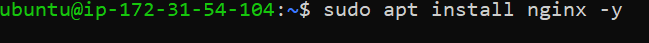

- Enter `sudo apt install nginx -y`
- This will install 'nginx'
- Enter `sudo system start nginx`, this will start it.
- Enter `sudo systemctl status nginx` to check status, and `q` to exit. 

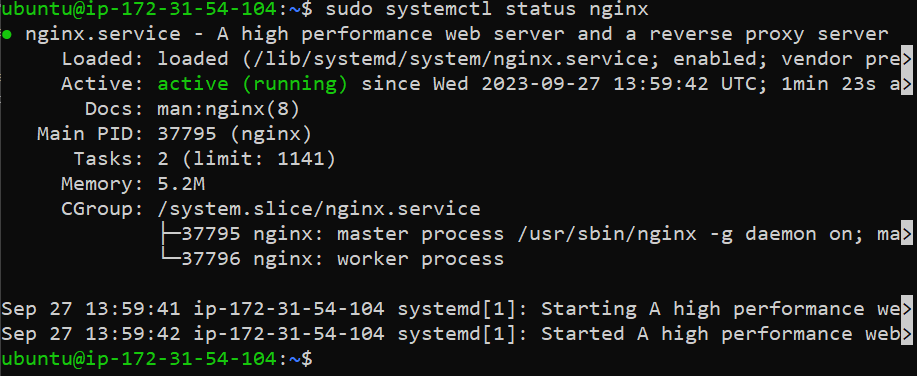