# CloudWatch Monitoring


* CloudWatch Monitoring
* CloudWatch Alert Management
* Auto-Scaling


### Once you have an APP VM running: 
#### (worse ----> better)

**A.** *As Is* - Things can go wrong. If CPU load gets too high => **falls over**.

**B.** *CloudWatch* (what does monitoring on AWS)
- CW monitoring CPU load
- data from the monitoring shows on the *dashboard* (updated regularly) with charts

=> problem: needs constant monitoring

**C.** *CloudWatch + alarm*
- CW monitoring CPU load
- Dashboard
- Alarm: you will be sent a notification (example: email) when CPU load gets to a certain point

**D.** *CloudWatch + AutoScaling*
- CW monitoring CPU load
- *AutoScaling* = service that allows you to automatically adjust the capacity of your AWS resources to meet the changing demand of your applications. 

<br>

Useful commands:
```
sudo apt update -y && sudo apt upgrade -y
sudo apt install tree
```

<br>

## Steps for setting up a Dashboard:

1. On your Instance, go to Monitoring and click on Manage Detailed Monitoring:

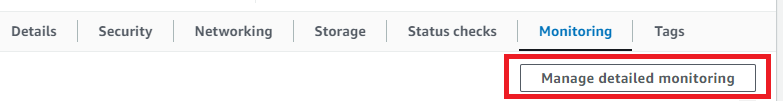

<br>

2. Next, select Enable and Click Confirm:

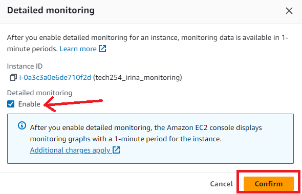

<br>

3. Next, click Add to Dashboard:

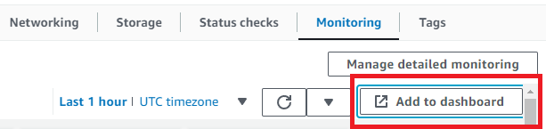

<br>

4. A popup will show up, press on Create New:

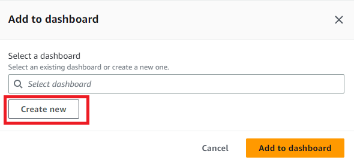

<br>

5. Next, choose the dashboard name and then press Create:

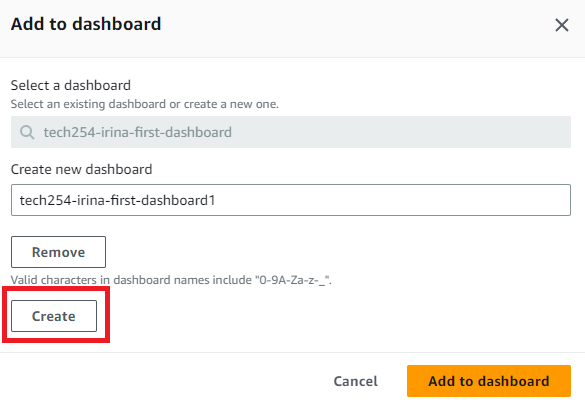


6. Finally, press the 'Add to Dashboard' button:

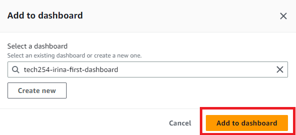
<br>

What the Dashboard will look like:

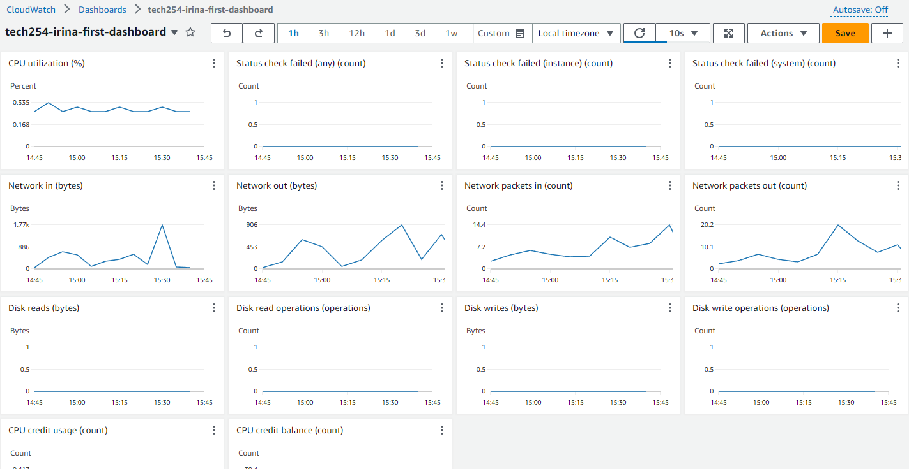


<br>


## How to create a CPU Usage Alarm:
1. Go to CloudWatch on the AWS Console:

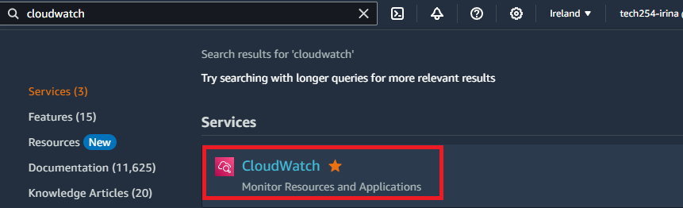

<br>

2. Next, on the left-hand panel, click on Alarms -> All alarms:

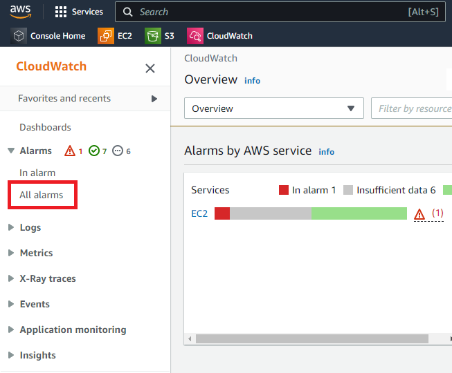

<br>

3. Next, click on 'Create Alarm' button:

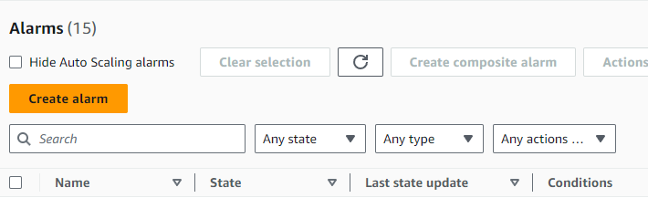

<br>

4. Next, click on Select metric:

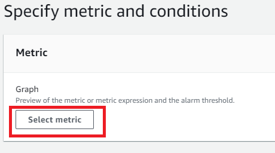

<br>

5. Next, click on EC2 Metric:

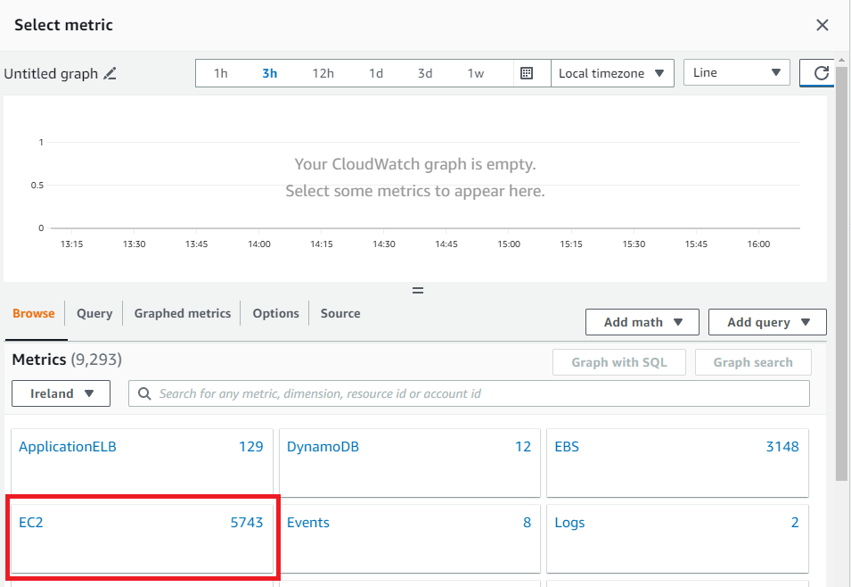

<br>

6. Next, click on Per-Instance Metrics:

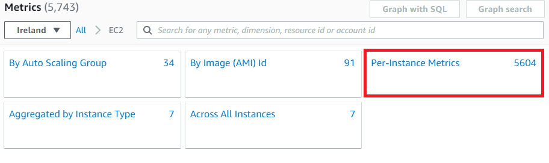

<br>

7. Next, select the correct instance ID and what metric you want to use (in our case, CPUUtilization) and press 'Select metric':

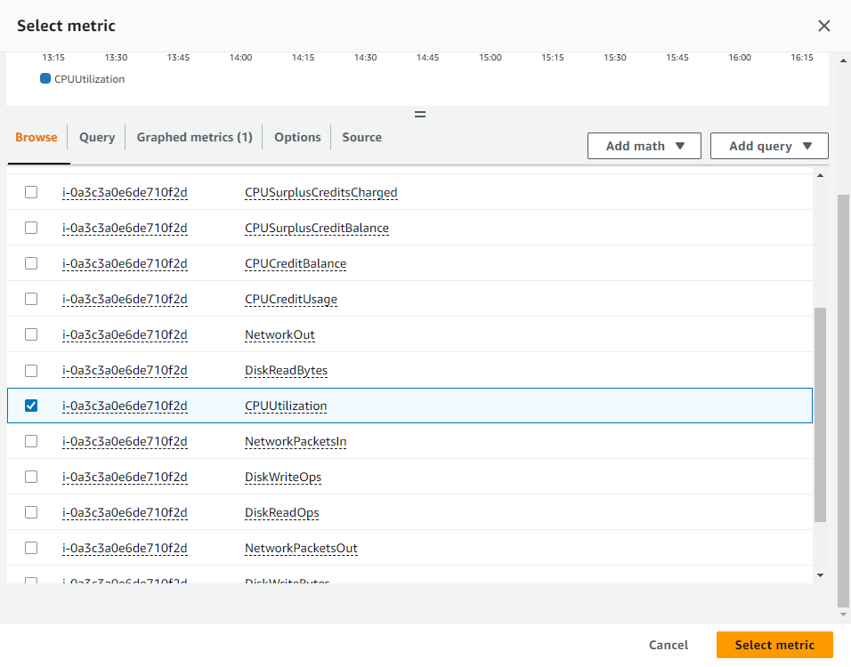

<br>

8. Choose how often you want the check to take place in the Period section:

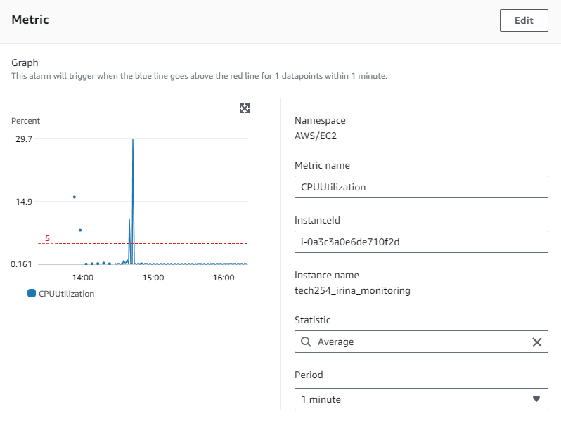

<br>

9. Conditions, in our case we are choosing greater than 5% for the CPU usage:

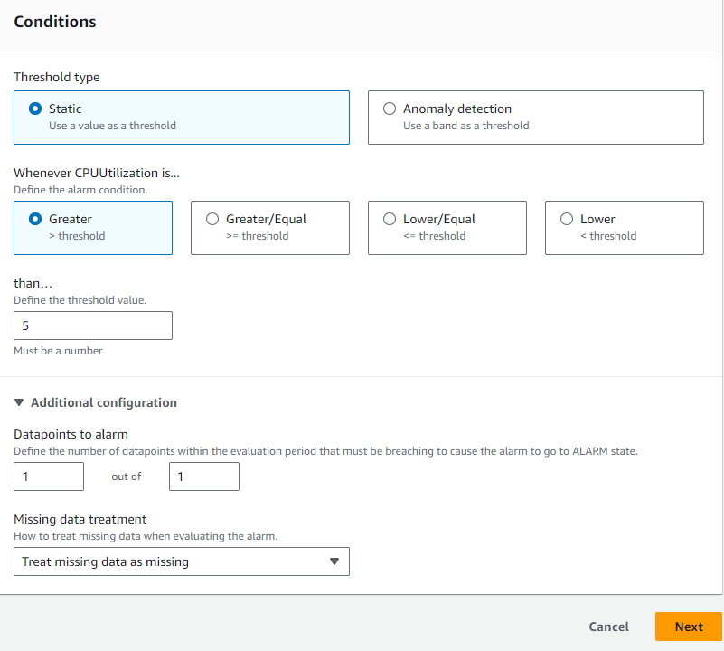

<br>

10. Click on create new topic, and add your email address in the section:

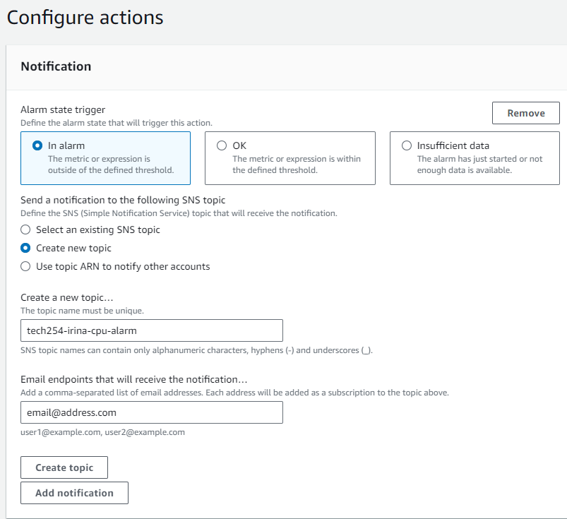

<br>

11. Choose a name:

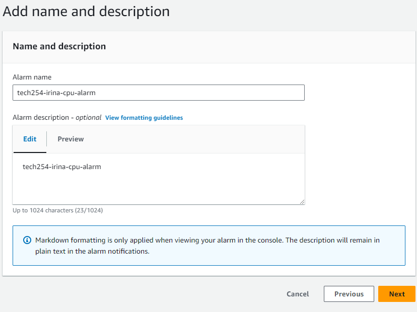

<br>

12. Now you will be able to preview all choices, once you're happy you can press `create alarm`.

13. You will have to confirm subscription on your email address:

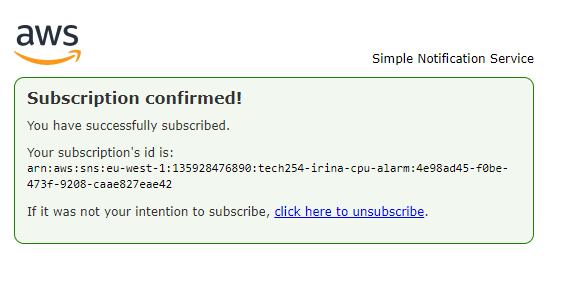

<br>

If the alarm gets triggered, you will receive an email that looks like this:

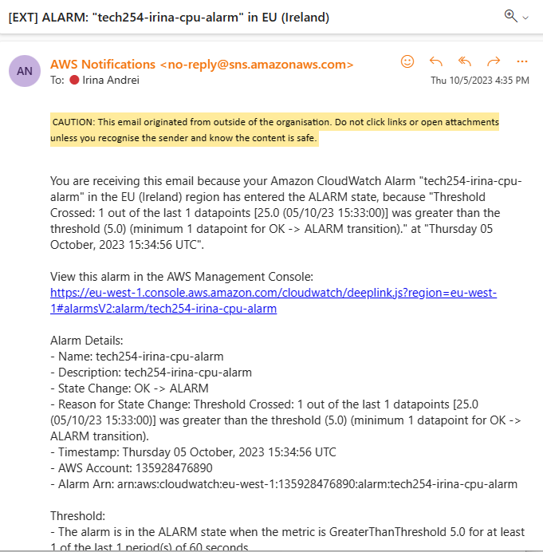

<br>

Sources:
- [Create a CPU usage alarm](https://docs.aws.amazon.com/AmazonCloudWatch/latest/monitoring/US_AlarmAtThresholdEC2.html)