# AWS Auto Scaling Group

We need to be deploying app with HA-SC (High Availability and Scalability).

<br>

Why we use Diagrams:
- memorable
- somplifies things
- good way to review -> can I draw what I have learnt? great way to check what you know.

Options for diagrams:
- draw.io
- app.diagrams.net (one I use)
- Lucid
- Visio (Microsoft Office package)

<br>

### Scenarios once you have an APP VM running: 

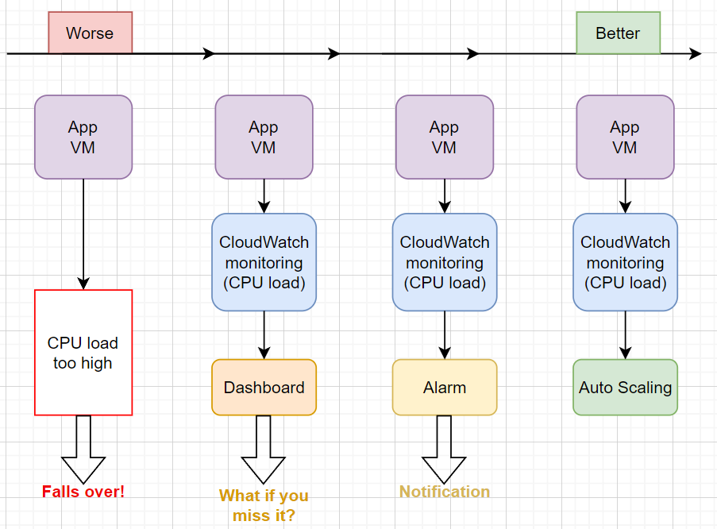

**A.** *As Is* - Things can go wrong. If CPU load gets too high => **falls over**.

**B.** *CloudWatch* (what does monitoring on AWS)
- CW monitoring CPU load
- data from the monitoring shows on the *dashboard* (updated regularly) with charts

=> problem: needs constant monitoring

**C.** *CloudWatch + alarm*
- CW monitoring CPU load
- Dashboard
- Alarm: you will be sent a notification (example: email) when CPU load gets to a certain point

**D.** *CloudWatch + AutoScaling*
- CW monitoring CPU load
- *AutoScaling* = service that allows you to automatically adjust the capacity of your AWS resources to meet the changing demand of your applications. 

<br>

## Auto Scaling Group and Load Balancer Overview:

```DIAGRAM PLACEHOLDER /to be updated```


We have a VM provisioned with all dependencies for the APP.
- we made an AMI from it.
- we need a LAUNCH TEMPLATE for an Instance, with instructions on what AMI to choose and all User Data, Security Groups and SSH Key
- AUTO SCALING GROUP which uses Launch Template to create VMs

Group Size:
- minimum number to create: 2
- desired number to create: 2
- maximum number to create: 3
(in our case, will be created in Ireland)

We are getting **High Availability** by putting each VM in a different Availability Zone inside the Region (in our case, Ireland):
* AZ 1a: __
* AZ 1b: __
* AZ 1c: ...

Scaling Policy: monitors CPU usage - 50%

Internet -----> Load Balancer 

<br>

### Blue Green Deployment
[What is Blue Green Deployment? - Red Hat](https://www.redhat.com/en/topics/devops/what-is-blue-green-deployment)

Blue green deployment is an application release model that gradually transfers user traffic from a previous version of an app or microservice to a nearly identical new release—both of which are running in production. 

<br>

### Command to trigger a Stress Test:
```shell
sudo apt-get install stress
stress --cpu 1 --timeout 20
```
- Cpu 1 => how many cpus to target
- Timeout => The duration of the stress test


<br>

### My Script for the Updated AMI with working App+nginx:

```shell
#!/bin/bash

cd /home/ubuntu/sparta_test_app/app
sudo systemctl restart nginx
npm install
pm2 kill
pm2 start app.js
```

<br>

## Steps for Creating Auto Scaling Group and Load Balancer:
1. Make sure your Launch Template has all dependencies sorted and it's ready to go.

2. On AWS, Left-Hand side click on Auto Scaling: 

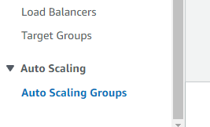

3. Next, choose an appropriate name and the correct Launch Template:

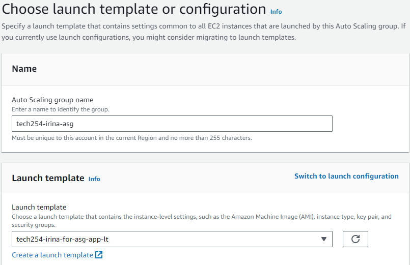

4. Choose the correct Availability Zones:

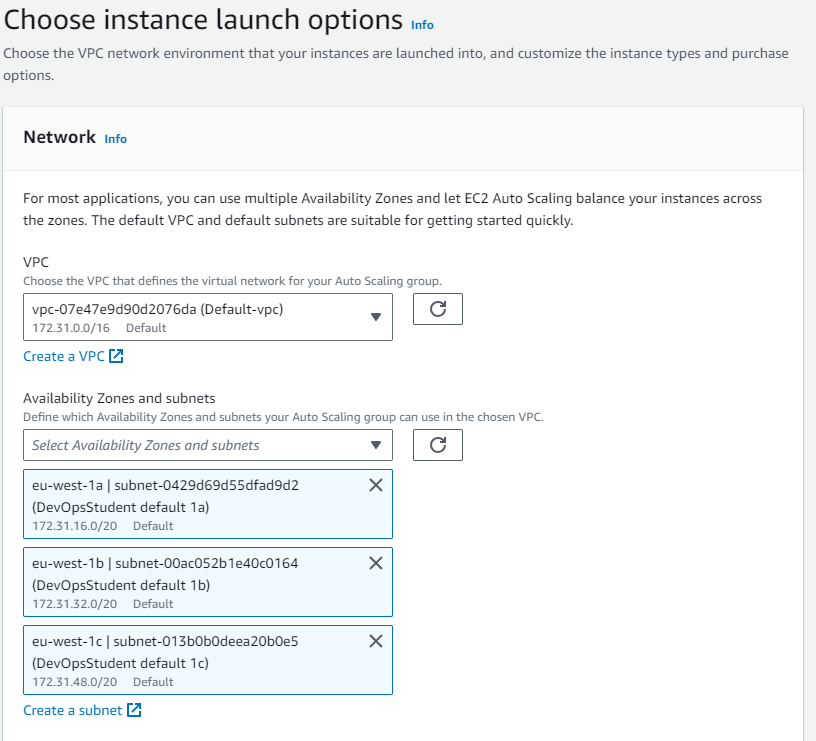

5. Next, Instance type requirements. if you don't need to change these, press the 'Next' button.

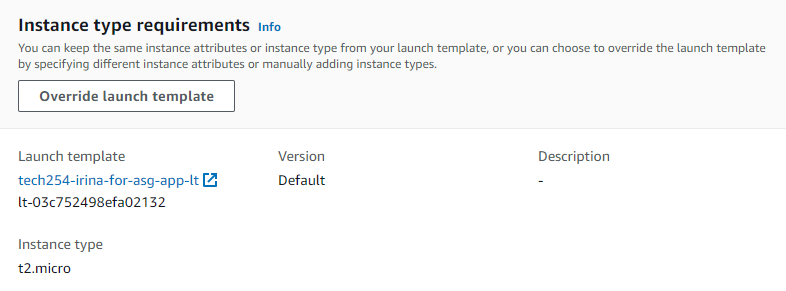

6. Choose to Attach to a new load balancer:

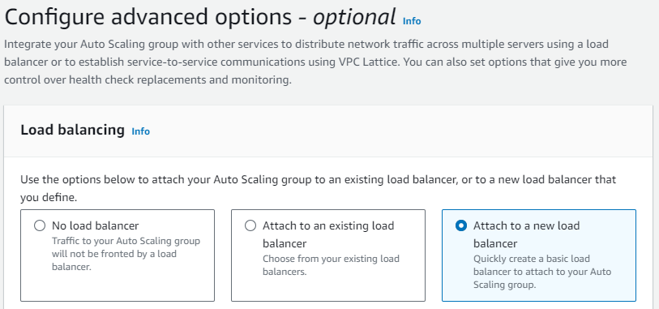

7. Choose an appropiate name for Load Balancer and choose 'Internet-facing' scheme for it:

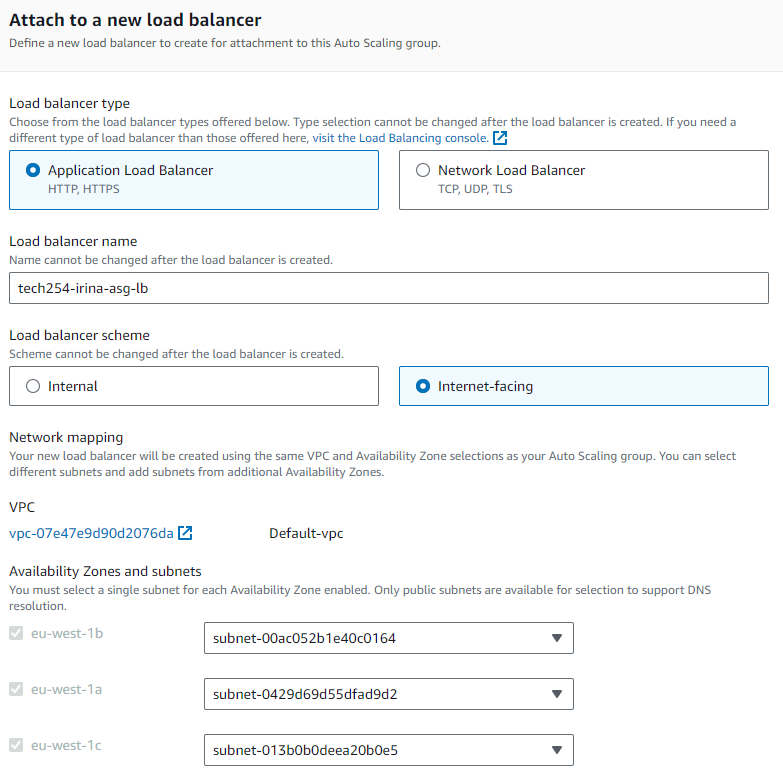

8. Click 'Create a target group' and give the target group an appropriate name:


9. Leave all other settings as default, but Turn on Elastic Load Balancing health checks and then press Next:

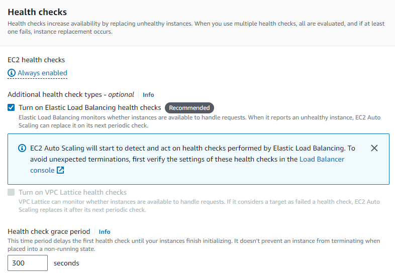

10. Choose desired, minimum and maximum capacity:

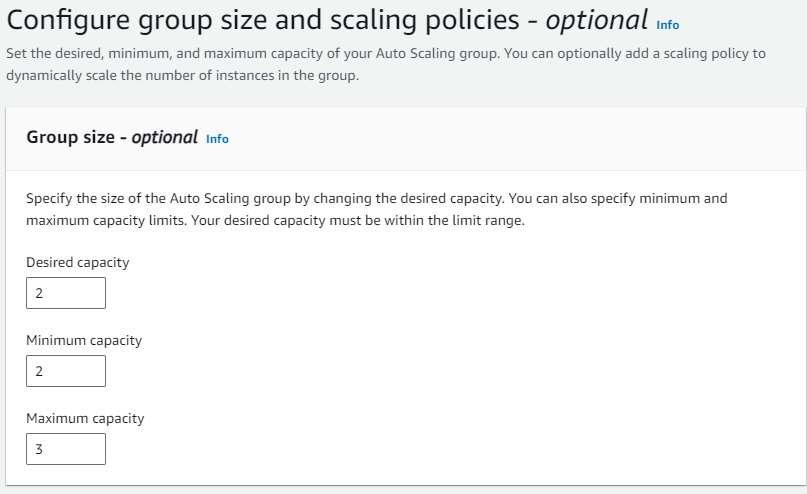

11. Choose target scaling policy, which will trigger a new Instance once CPU agerage usage passes 50%. Once you're happy with all settings, press Next.

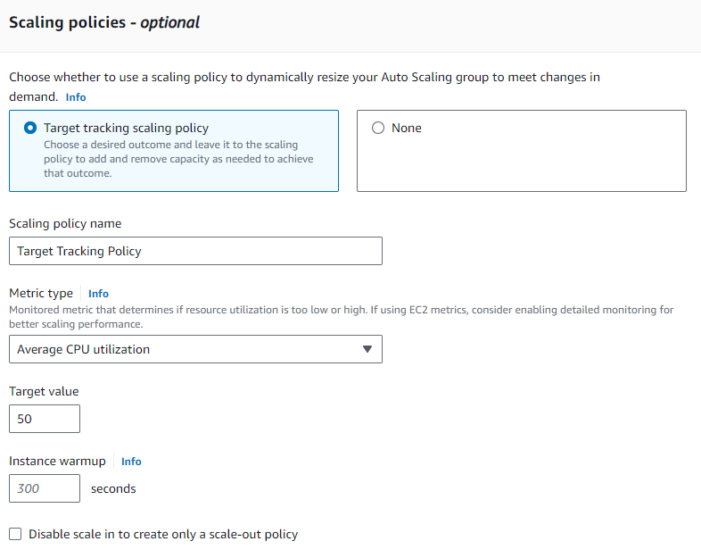

12. You can add a notification. Afterwards, press next:


13. Add at least one tag, Name (with an appropriate name) and then press Next:

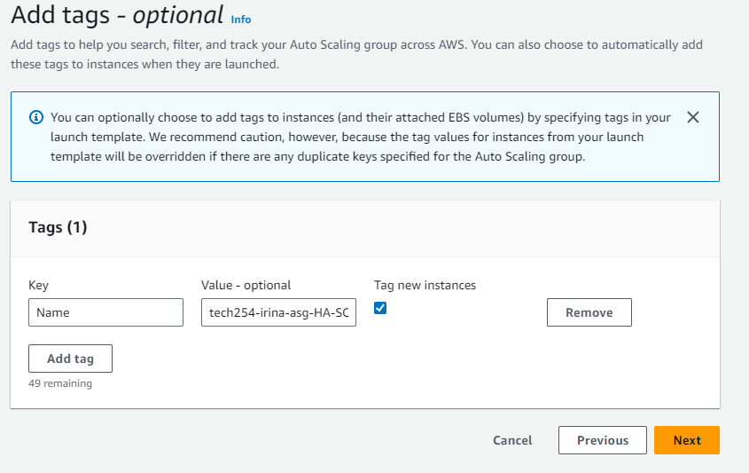

14. You will now get a Preview page, once you are satisfied there's no mistakes, press Create auto Scaling group:

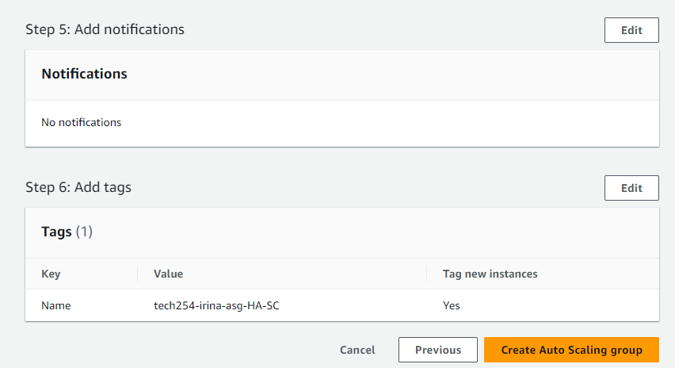


15. Go to Load Balancer on the left hand side panel: 

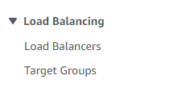

16. Find your Load Balancer by the name you chose and there you will be able to find the access address: 


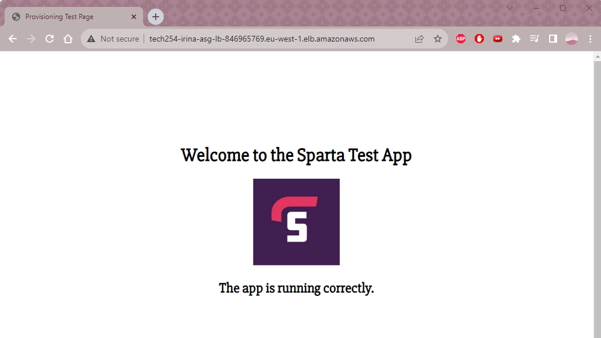


<br>

### When Deleting all we created:
1. First, get rid of Load Balancer.
2. Then, remove Target Group.
3. Finally, delete Auto Scaling Group.
