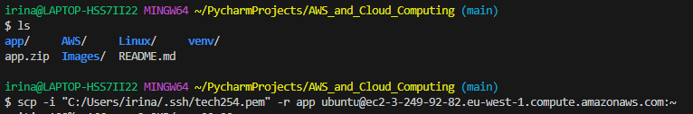

# NodeJs App Deployment 

### NodeJs App Specifications:
- *Needs* Linux vm running **Ubuntu 18.04**
- *Needs* **Web Server** (nginx) 
- *Needs* right version of **NodeJs: 12.x**
- *Needs* the **app code itself**
- Will run on port 3000
- Front page, posts page


## Steps:
1. Start an *EC2 Instance* and install the *'nginx'* Web Server (for more detailed steps, you can access [EC2 instance and 'nginx' Steps](/AWS/EC2_instance.md)). Recap of commands:
```
cd .ssh
chmod 400 tech254.pem
ssh -i "tech254.pem" ubuntu@ec2-3-249-92-82.eu-west-1.compute.amazonaws.com

sudo apt update
sudo apt upgrade -y
sudo apt install nginx -y
sudo systemctl start nginx
```

<br>

2. Copy the App files you need to your EC2 Instance. There are 2 ways for this:

#### A) - Using `scp` in your local terminal:
```
scp -i "<filepath to .pem file>" -r app Ubuntu@<public IP>
```
For this particular app (bear in mind, the download can take a while):

```
scp -i "C:/Users/irina/.ssh/tech254.pem" -r app ubuntu@ec2-3-249-92-82.eu-west-1.compute.amazonaws.com:~
```




#### B) - On the EC2 Instance terminal, cloning files from a GitHub Repository:
```
git clone https://github.com/LSF970/sparta_test_app.git
```
Make sure all the files have been saved:


<br>

3. Once you have the app files on your Instance, you will need NodeJs. First, you have to tell the OS what version you want it to install: 
```
curl -sL https://deb.nodesource.com/setup_12.x | sudo -E bash -
```


This might take a couple of minutes.

<br>

4. Now we can proceed to install NodeJs:

```
sudo apt install nodejs -y
```


If you want to check you have the correct package version, enter this command:

```
node -v
```


<br>

5. Finally, now you can install your application.

```
sudo npm install pm2 -g
npm install 
```

`npm` => Node Package Manager.
`ps2` => Process Manager for node processes - it gives you more control over processes that run Nodejs.


Don't worry about the warnings. 


<br>

6. Run your app.

```
node app.js
```


<br>

7. Make sure the Security Group has an Inbound Rule for port 3000. 


### App Preview:


<br>


## Automation Script

This script will automate the entire app installation.

### Steps:

1. Creating and opening a Script file:
```
nano <script_name.sh>
```


2. Writing your script code:
```
#!/bin/bash

# cloning the app files to the instance
git clone https://github.com/LSF970/sparta_test_app.git

# tell the os what version of nodejs you want
curl -sL https://deb.nodesource.com/setup_12.x | sudo -E bash -

# install nodejs
sudo apt install nodejs -y

# install process manager
sudo npm install pm2 -g

# go to the app folder
cd ./sparta_test_app/app

# install your app
npm install

# run the app
node app.js
```


Press `Ctrl + X` to Exit, choose `Y` to save file and press `Enter` to confirm file name save.

<br>

3. Add permision for this script to be run:

```
sudo chmod +x provision_app.sh
```


<br>

4. Call the script:

```
./provision_app.sh
```


<br>


### App Preview after Script was run:


