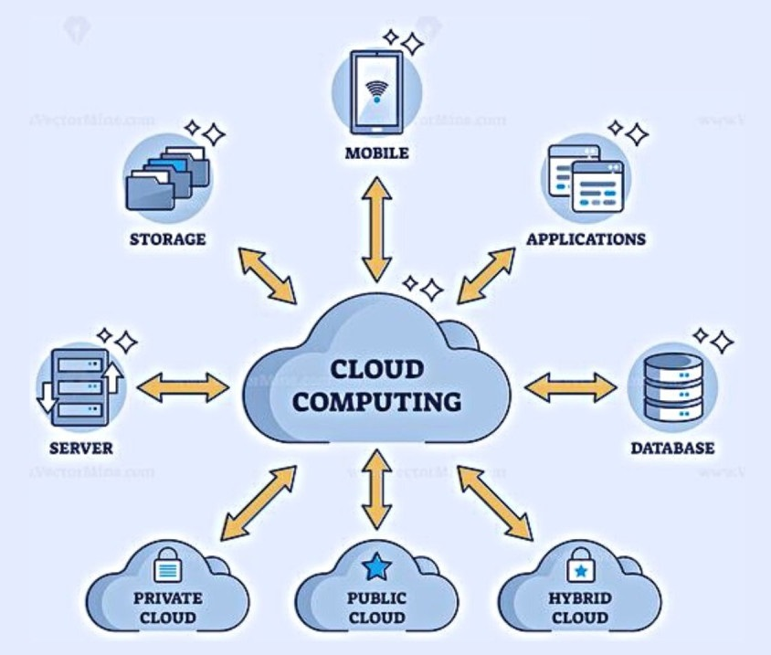
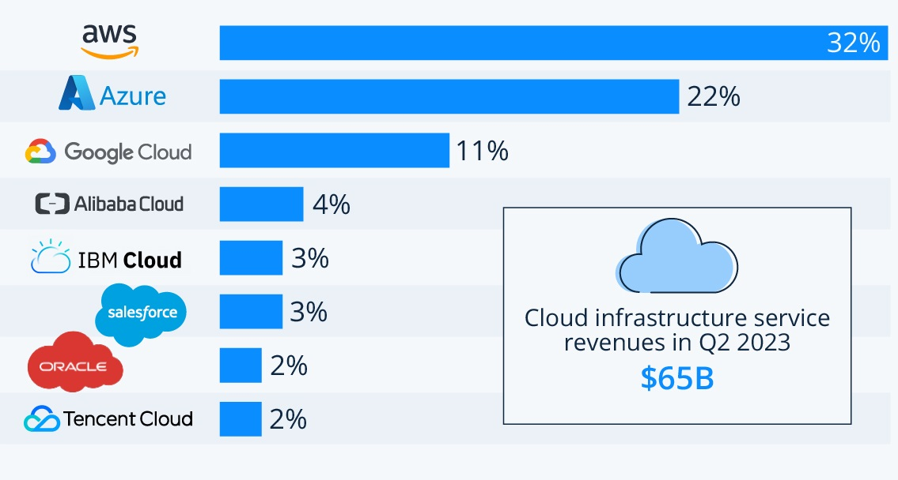

# AWS and Cloud Computing

### What is Cloud Computing? 

Cloud computing is *on-demand access*, via the internet, to computing resources — applications, servers (physical servers and virtual servers), data storage, development tools, networking capabilities and more — hosted at a remote data center managed by *a cloud services provider* (or CSP). The CSP makes these resources available for a *monthly subscription fee* or bills them according to usage.

 

### Timeline of Cloud Computing
Today the cloud is a vital online technology that is used all over the world and since the COVID-19 crisis, the cloud computing market has been on a rapid upward trajectory. 
- **1960s**: Clouds began to form over the technology landscape as early as the 1960s. Computer scientist J.C.R. Licklider had a vision of *an interconnected global population* that could access programs and data anywhere, from any site and his initial involvement spurred the development of the Advanced Research Projects Agency Network (ARPANET).

- **1999**: *Salesforce* became the first company to offer applications over the internet, heralding the arrival of Software as a Service. 3 years later, the industry grew massively with video, music and other media being hosted and delivered online.

- **2006**: Amazon launched the first commercial cloud – the Elastic Computer Cloud (AWS - Amazon Web Services) in 2006.

- **2008**: Google introduced radical pricing models with *free-entry-level plans* and low-cost computing and storage services with its Google App.

- **2010**: Software giant Microsoft entered the cloud market with *Azure*, which supports streamlined development of web and mobile apps, to support a rapidly growing mobile industry.

- **2012**: Cloud adoption takes off - A Spiceworks survey noted a significant 71% increase over the previous year in cloud adoption for SMBs, with file sharing (52%) and hosted email (42%) two of the top services used. 

Today, the cloud underpins most new technological disruptions, including composable business, and has proven itself during times of uncertainty with its resiliency, scalability, flexibility and speed. Hybrid, multicloud and edge environments are growing and setting the stage for new distributed cloud models.

 

### What can you do with Cloud Computing?
There are many uses of cloud computing that can offer significant business advantages to companies. Cloud computing is a computing model and set of technologies that allows consumers to access cloud services using the Internet on a pay-as-you-go basis:

1. File storage
2. Big Data Analytics
3. Data backups and archiving
4. Disaster recovery
5. Software testing and development
6. Infrastructure as a service (IaaS) and Platform as a service (PaaS)
7. Communication
8. Social Networking
9. Business process

 

### What are the 4 Types of Cloud?
1. **Private Clouds**

A private cloud is a type of cloud computing environment that provides IT infrastructure services to a particular user or organization. There is no interference from third parties in a private cloud.

2. **Public Clouds**

While private clouds provide computing services only to a single organization, public clouds are managed by third-party vendors that offer on-demand cloud computing services to multiple organizations. Some examples of public clouds are Google, Microsoft Azure, and Amazon Web Services (AWS).

3. **Hybrid Clouds**

Hybrid clouds allow the integration of private and public cloud features into a single IT infrastructure. It brings together private and public cloud environments from multiple vendors and provides users with a flexible and scalable cloud environment.

4. **Multi-Clouds**

Multi-clouds are often confused with hybrid clouds. Multi clouds bring together multiple public clouds from different cloud service providers, whereas hybrid clouds integrate the features of public and private cloud environments.

 

### What are the different types of cloud SERVICE?
Each type of cloud computing provides different levels of control, flexibility, and management so that you can select the right set of services for your needs. 
* **Infrastructure as a Service** (IaaS) contains the basic building blocks for cloud IT. It typically provides access to networking features, computers (virtual or on dedicated hardware), and data storage space. IaaS gives you the highest level of flexibility and management control over your IT resources. It is most similar to the existing IT resources with which many IT departments and developers are familiar. 
* **Platform as a Service** (PaaS) removes the need for you to manage underlying infrastructure (usually hardware and operating systems), and allows you to focus on the deployment and management of your applications. This helps you be more efficient as you don’t need to worry about resource procurement, capacity planning, software maintenance, patching, or any of the other undifferentiated heavy lifting involved in running your application. 
* **Software as a Service** (SaaS) provides you with a complete product that is run and managed by the service provider. In most cases, people referring to SaaS are referring to end-user applications (such as web-based email). With a SaaS offering, you don’t have to think about how the service is maintained or how the underlying infrastructure is managed. You only need to think about how you will use that particular software. 

 

### Advantages/Disadvantages of the Cloud
#### Advantages:

1. Disaster Recovery (DR) - data is at a reduced risk of system failure since all data is stored and backed-up on an external devise often thousands of miles away from your own location. This means you avoid expensive data retrieval.

2. Access your data anywhere - Cloud storage makes it easy for employees to login and access other team members’ work regardless of location and distance that separates team members. 

3. Low cost - Cloud storage eliminates the need to pay for software licences and updates since all this is included in one global monthly price. 

4. Scalability - You only pay for the amount of storage you need. If your business experiences growth, the cloud operator is able to accommodate your corresponding growth in data storage needs.

5. Security - Professional cloud storage firms typically offer far better data security than is otherwise available to small businesses through efforts of their own. Cloud storage companies offer password protected data storage. 

 

#### Disadvantages:

1. Lack of total control - Since data is held offsite by a company you do not control, you lack the ability to control and customise your data storage set-up. This likely to be an issue for larger businesses who have complex storage needs. 

2. Difficult to migrate - Once you’ve signed up and started using one particular cloud storage provider, it is difficult to migrate data to another cloud provider later on. This is a phenomenon known as 'vendor lock-in'.

3. Requires Internet - If your Internet connection fails, so does your access to remotely stored data. Internet failure thus leads to costly downtime when your business heavily relies on cloud storage. 

4. Security and privacy have been an issue - 
Cloud storage means handing over the control of confidential information to a third party company. In the past things have been known to go wrong with cloud storage companies. 

5. Fixed contracts can be a problem - Some cloud storage suppliers may try to fix you into a long term contract. This may be disadvantageous if your data storage needs reduce meaning you must now pay for storage you're not even using.

 

### What is OpEx vs CapEx?
**Capex**, or *capital expenditure*, is a business expense incurred to create future benefit (i.e., acquisition of assets that will have a useful life beyond the tax year). For example, a business might buy new assets, like buildings, machinery, or equipment, or it might upgrade existing facilities so their value as an asset increases.

On the other hand, those expenditures required for the day-to-day functioning of the business, like wages, utilities, maintenance, and repairs, fall under the category of **Opex**, or *operational expenditure*. Opex is the money the business spends in order to turn inventory into throughput. Operating expenses also include depreciation of plants and machinery which are used in the production process.

 

### Marketshare - What is the breakdown?

 

### What are the 3 largest Cloud providers known for (What makes them popular?)
1. AWS (Amazon) - AWS is mainly attributed to its ability to provide computing power and storage capacity at affordable costs with high reliability.
2. Azure (Microsoft) offers serverless relational databases such as Azure SQL and non-relational databases such as NoSQL. In addition, the platform is frequently used for backup and disaster recovery.
3. Google Cloud - Google offers a complete data foundation to unify all workloads and manage the entire data life cycle. The solution is designed to run data anywhere, so you can leverage your data across all clouds, on-premises, and access it in the most popular SaaS apps.

 

### What are the 4 pillars of DevOps? 
Here are the 4 pillars of effective DevOps:
- Collaboration
- Affinity
- Tools
- Scaling

 

Sources:
- [What is cloud computing? -ibm.com](https://www.ibm.com/topics/cloud-computing)
- [Cloud Computing Diagram - linkedin.com](https://www.linkedin.com/pulse/introduction-cloud-computing-information-upload)
- [History of Cloud Computing - cybermagazine.com](https://cybermagazine.com/cloud-security/history-cloud-computing)
- [Common Uses of Cloud Computing](https://digitalcloud.training/9-common-uses-of-cloud-computing/)
- [Types of Cloud](https://emeritus.org/blog/technology-types-of-cloud-computing/)
- [Types of Cloud Service](https://aws.amazon.com/what-is-cloud-computing/)
- [Pros and Cons of Cloud Storage](https://www.securestorageservices.co.uk/article/11/pros-and-cons-of-cloud-storage)
- [Capex vs. Opex](https://www.diffen.com/difference/Capex_vs_Opex)
- [Marketshare](https://www.google.com/url?sa=i&url=https%3A%2F%2Fwww.statista.com%2Fchart%2F18819%2Fworldwide-market-share-of-leading-cloud-infrastructure-service-providers%2F&psig=AOvVaw3F21gKX2s0rb_J1i-GTD_3&ust=1695812859292000&source=images&cd=vfe&opi=89978449&ved=2ahUKEwjojvipkciBAxVepicCHSmXDUUQr4kDegQIARBh)
- [AWS](https://www.exabytes.my/blog/why-amazon-aws-widely-used/#:~:text=It's%20easy%20to%20see%20why,affordable%20costs%20with%20high%20reliability.)
- [Azure](https://www.techtarget.com/searchcloudcomputing/definition/Windows-Azure#:~:text=Azure%20is%20also%20commonly%20used,for%20backup%20and%20disaster%20recovery.)
- [Google](https://cloud.google.com/why-google-cloud)
- [4 Pillars of DevOps](https://www.oreilly.com/library/view/effective-devops/9781491926291/ch06.html)