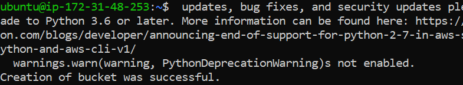
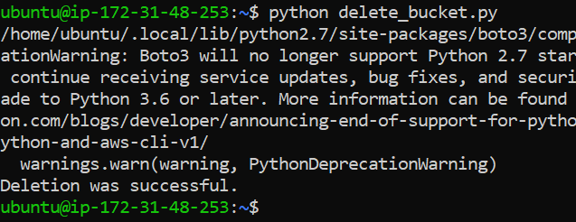

# S3: Scalable Storage Service in the Cloud

Buckets = a container for objects stored in AWS S3. You can store any number of objects in a bucket.

* AWS CLI: command line interface
* We will use AWS CLI to do **CRUD** (CREATE, READ, UPDATE and DELETE).
* spin up = instance coming online
* We will need to use our Access Keys for Aws - CLI 

<br>

### Steps:
1. Create an Instance with Ubuntu 18.04 (1e9) and access it through your Git Bash terminal. Don't forget to `update and upgrade`.

2. You will need to install Python: 
```
sudo apt install python -y
```

3. Afterwards, install PIP:
```
sudo apt install python-pip -y
```

If you enter the Python interface, `exit()` to exit 

4. We need to use PIP to install AWS CLI:
```
sudo pip install awscli
```

5. Next we need to enter the AWS configuration:
```
aws configure
```

6. What will be displayed, one by one, and what you need to enter:
```
AWS Access Key ID [None]: <Access Key ID >
AWS Secret Access Key [None]: <Secret Access Key>
Default Region Name [None]: eu-west-1
Default Output Format [None]: json
```

7. Next, check it works:
```
aws s3 ls
```
You will get a list of all the buckets. If you see this, it means you are now connected to AWS using the command line.

8. We will next make a bucket:
```
aws s3 mb s3://tech254-irina-bucket --region eu-west-1
```

* `s3` - service you want to interact with
* `mb` - make bucket
* You can't use underscore, only dashes
* This will print:
```
make_bucket: tech254-irina-bucket
```

9. Next we will create a text file and add some sample text to it.
```
sudo nano filename
```

10. Copy a file to the bucket (uploading to bucket):
```
 aws s3 cp example.txt s3://tech254-irina-bucket 
```
This will print:
```
upload: ./example.txt to s3://tech254-irina-bucket/example.txt
```

11. Downloading (syncing) from the bucket (this will also create the folder on our Instance, in this case `s3_downloads`):
```
 aws s3 sync s3://tech254-irina-bucket s3_downloads
```

This will print:
```
download: s3://tech254-irina-bucket/example.txt to s3_downloads/example.txt
```

12. Delete a file from the bucket:
```
aws s3 rm s3://tech254-irina-bucket/example.txt
```

This will print:
```
delete: s3://tech254-irina-bucket/example.txt
```

13. Delete the bucket:

```
aws s3 rb s3://tech254-irina-bucket
```

Useful Links:
- [CLI Command reference](https://docs.aws.amazon.com/cli/latest/)
- [CLI Command reference - S3](https://docs.aws.amazon.com/cli/latest/reference/s3/)


<br>

## Scripts

#### A. Before running scripts, you will have to install Boto3:
```
sudo pip install boto3
```
If that doesn't work, you can try:

```
python -m pip install boto3
```

```
sudo apt install python3-pip
```

#### B. Then you will have to create the scripts using `nano`:
```
sudo nano <script_name.py>
```

#### C. Once you have a script, you will need to add permissions for it to be executed:
```
sudo chmod +x <script_name.py>
```

#### D. You can now execute your script:
```
python3 <script_name.py>
```
<br>

### List of our Scripts:

1. `create_bucket.py`: Making a bucket on AWS
```
import boto3

s3 = boto3.client('s3')
# this stores the connection to aws

s3.create_bucket(Bucket='tech254-irina-bucket-test',
                CreateBucketConfiguration={
                        'LocationConstraint': 'eu-west-1'
                                        })
# creating the bucket

print("Creation of bucket was successful.")
# printing back an output message to show the creation was successful.
```



<br>

2. `upload_file_to_bucket.py`: Uploading a file to a bucket on AWS
```
import boto3

s3 = boto3.client('s3')
# this stores the connection to aws

s3.upload_file('/home/ubuntu', 'tech254-irina-bucket-test', 'example.txt')
# uploading file
# s3.upload_file('/path/to/local/file', 'bucket-name', 'your-object-name')

print("Upload was successful.")
# printing back an output message to show the upload was successful.
```

<br>

3. `download_file_from_bucket.py`: Downloading a file from a bucket on AWS
```
import boto3

s3 = boto3.client('s3')
# this stores the connection to aws

s3.Bucket('tech254-irina-bucket-test').download_file('example.txt', 's3_downloads')
# downloading file
# s3.Bucket('BUCKET_NAME').download_file('OBJECT_NAME', 'FILE_NAME')

print("Download was successful.")
# printing back an output message to show the download was successful.

```

<br>

4. `delete_bucket.py`: Deleting a bucket on AWS
```
import boto3

s3 = boto3.client('s3')
# this stores the connection to aws

s3.delete_bucket(Bucket='tech254-irina-bucket-test')
# deleting bucket
# s3.delete_bucket(Bucket=bucket_name)

print("Deletion was successful.")
# printing back an output message to show the deletion was successful.
```


<br>

Sources:

- https://saturncloud.io/blog/running-python-scripts-on-an-existing-ec2-instance-on-aws/
- https://boto3.amazonaws.com/v1/documentation/api/1.9.42/guide/s3-example-creating-buckets.html
- https://saturncloud.io/blog/how-to-upload-to-amazon-s3-using-boto3-and-return-public-url/
- https://www.stackvidhya.com/download-files-from-s3-using-boto3/
- https://boto3.amazonaws.com/v1/documentation/api/latest/reference/services/s3/client/delete_bucket.html
