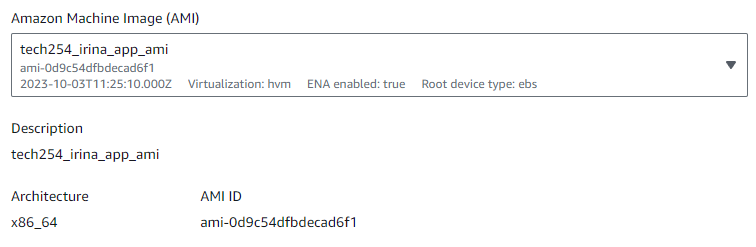
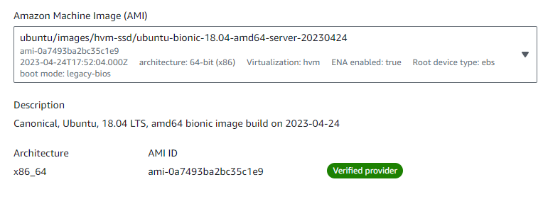
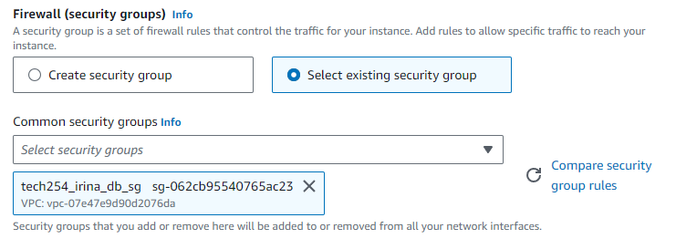
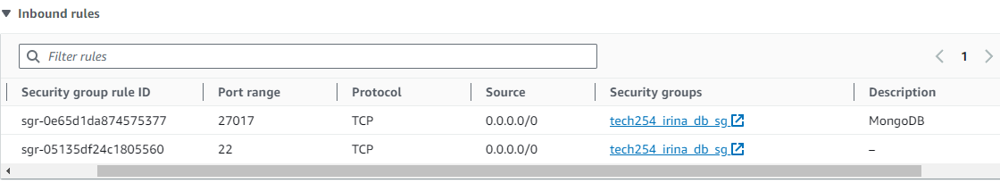
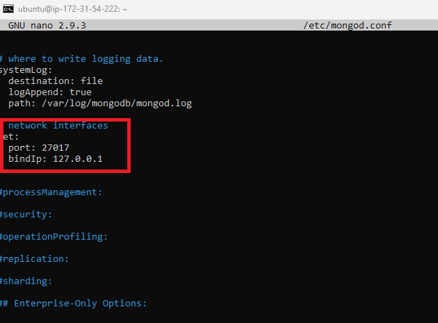
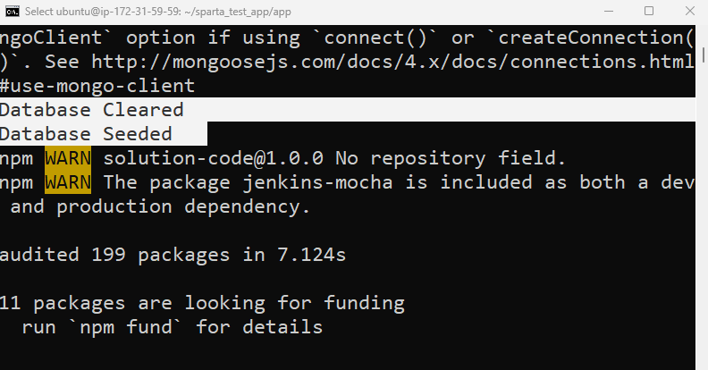

# MongoDB: NoSQL Database - node.js
- very structured
- good for referential structure
- everything is stored as a document
- Port for MongoDB: 27017

<br>

We will:
1. Create Database
2. Install MongoDB
3. Configure MongoDB for external connection

<br>

## Steps:

1. Create your Instance for the app. Make sure to choose the AMI you created with your app as your Image:




2. Create your Database Instance. Make sure to choose the correct AMI for your Database Image:



Make sure you also choose an appropriate Security Group (don't add any ports that you don't really need!)





3. Connect to both Instances using 2 separate Git Bash terminals. 


4. Setting up the MongoDB Server:

* Update and upgrade:
```
sudo apt update
sudo apt upgrade -y
```

* In the Git Bash terminal for the Database, get the key for MongoDB:

```
wget -qO - https://www.mongodb.org/static/pgp/server-3.2.asc | sudo apt-key add -
```
=> This will print out `OK``.

* Verifying the key and the location:
```
echo "deb http://repo.mongodb.org/apt/ubuntu xenial/mongodb-org/3.2 multiverse" | sudo tee /etc/apt/sources.list.d/mongodb-org-3.2.list
```
=> This will print out `deb http://repo.mongodb.org/apt/ubuntu xenial/mongodb-org/3.2 multiverse`

* Getting the correct update (in our case, v3.2):
```
sudo apt update
```

* Installing MongoDB:
```
sudo apt-get install -y mongodb-org=3.2.20 mongodb-org-server=3.2.20 mongodb-org-shell=3.2.20 mongodb-org-mongos=3.2.20 mongodb-org-tools=3.2.20
```
MongoDB itself has configuration settings which says what IPs can access the MongoDB.

* Modify the authorised IPs list (in our case, we are allowing all, so we need to modify it to `0.0.0.0`): 
```
sudo nano /etc/mongod.conf
```


* Start MongoDB:
```
sudo systemctl start mongod
```

* Enable MongoDB (it will start up when the VM will start up):
```
sudo systemctl enable mongod
```
=> This will print out `Created symlink /etc/systemd/system/multi-user.target.wants/mongod.service → /lib/systemd/system/mongod.service.`

* Check the status and make sure MongoDB is running:
```
sudo systemctl status mongod
```
=> Will confirm with ` Active: active (running)`

5. In the Git Bash terminal for the App Instance:

* Export using an environment variable where you put the public ip address:
```
export DB_HOST=mongodb://<<PUBLIC DB_Instance IP ADDRESS>>:27017/posts
```


* To check it works:
```
printenv 
printenv DB_HOST
```
=> Will print `mongodb://52.48.239.89:27017/posts`


* Running the app, go to the app location (in our case, ~/sparta_test_app/app):
```
npm install
node app.js
=> Will print `Your app is ready and listening on port 3000`

```
That will run in the foreground, if you want it to run in the background, enter the command:

```
pm2 start app.js
```

Confirmation:


