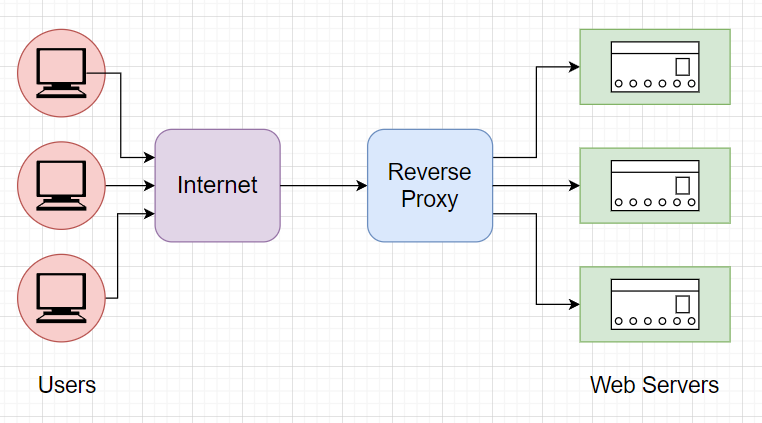
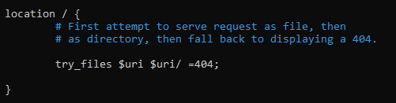
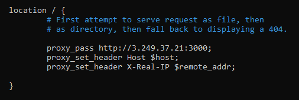
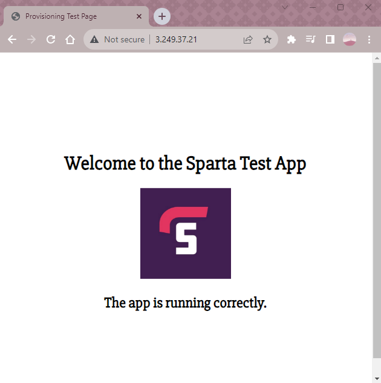

# Reverse Proxies

Research how to setup nginx so that by default, the default website will be http://localhost:3000/ (from the perspective of nginx) so you will just need to go to the app VM’s public IP address (no port 3000 in the URL) and the Sparta test app will be visible.


### What are ports?
A port in networking is **a software-defined number** associated to a *network protocol* that receives or transmits communication for a *specific service*.

<br>

### What is a reverse proxy? How is it different to a proxy?



#### 1. Proxy
A forward proxy, often called a proxy, proxy server, or web proxy, is a server that sits in front of a group of client machines. When those computers make requests to sites and services on the Internet, the proxy server intercepts those requests and then communicates with web servers on behalf of those clients, like a middleman.

#### 2. Reverse Proxy
A reverse proxy is a server that sits in front of one or more web servers and forwards client (e.g. web browser) requests to those web servers. Reverse proxies are typically implemented to help increase security, performance, and reliability.

#### Differences

A reverse proxy is a server that sits in front of web servers, intercepting requests from clients, whereas a proxy sits in front of the clients. 

With a reverse proxy, when clients send requests to the origin server of a website, those requests are intercepted at the network edge by the reverse proxy server. The reverse proxy server will then send requests to and receive responses from the origin server.

The difference between a forward proxy and reverse proxy is subtle but important. A simplified way to sum it up would be to say that *a forward proxy* sits in front of a client and ensures that **no origin server** ever communicates directly with that **specific client**. On the other hand, *a reverse proxy* sits in front of **an origin server** and ensures that **no client** ever communicates directly with that **origin server**.

<br>

### What is Nginx's default configuration (hint - 'sites-available' directory)
The default configuration for Nginx can be found at:
```
/etc/nginx/sites-available/default
```


<br>

### How do you set up a Nginx reverse proxy?
To set up an Nginx Rever proxy, you need to go to the default configuration and modify the file:

```
/etc/nginx/sites-available/default
```

You need to go to the location and enter the command:


```
proxy_pass http://<<public_IP_address>>:3000;
proxy_set_header Host $host; 
proxy_set_header X-Real-IP $remote_addr;
```



‌

<br>

After you modify that, the Public IP Address will display:



<br>

Sources:
- [What is a port? - techtarget.com](https://www.techtarget.com/searchnetworking/definition/port)
- [Differences between proxy and reverse proxy - cloudfare](https://www.cloudflare.com/learning/cdn/glossary/reverse-proxy/)