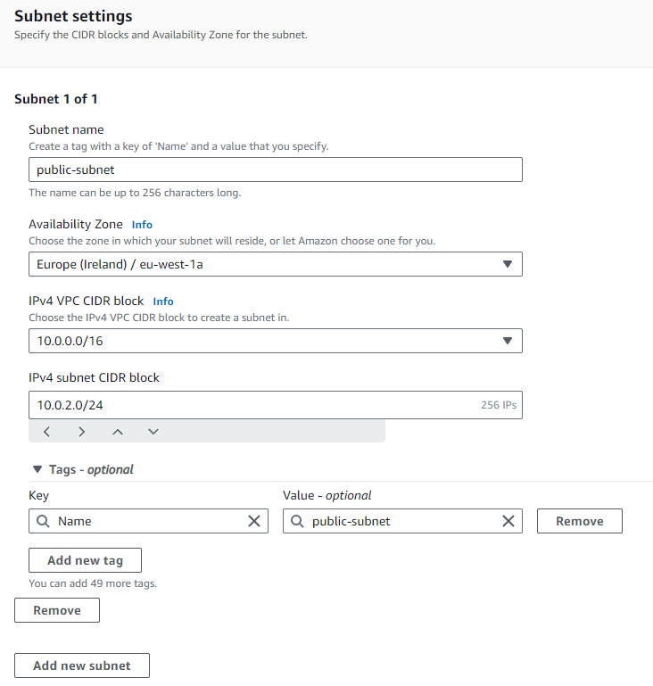
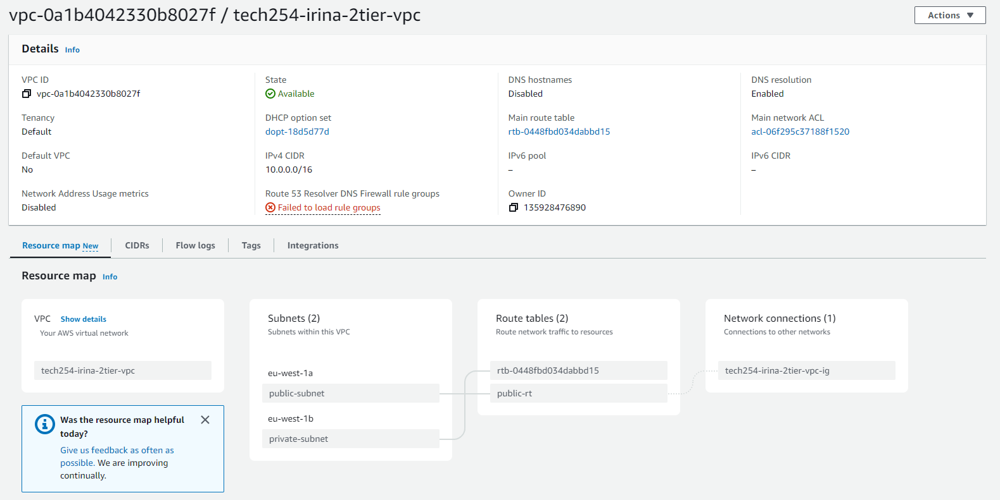

# VPC

VPC = **Virtual Private Cloud**

Most important aspect of VPC is **security**: using a VPC means having greater control over security.

* AWS creates a default VPC for you, and there is a default subnet for each Availability Zone.
* In Azure, these are called *Virtual Networks*, and there is no default VPC or default subnet => more setup involved.
* GCP, same as AWS, creates a default VPC for you. 

<br>


```placeholder for DIAGRAM```

In a custom VPC:
* You decide whether subnets are public or private and what Availability Zone you want for each subnet.
* SSH only allows login to the VPC, not to specific individual subnets. 

We will have a Public Subnet (A.Z. 1a) and a Private Subnet (A.Z. 1b)

<br>


```placeholder for DIAGRAM```

<br>

**CIDR Block** = defines the range of IP Addresses allowed (IP allowance).

You can set up a Public Router which will use the Public Route Table to send packets where they are allowed to go. 

**Public Route Table** => makes sure internet gateway will have traffic routed to our Public Subnet.

**Default Route Table** => makes sure traffic (packets) is routed *internally*. Requests for Database still go through this.

* The APP VM will still have a Public IP Address, but the Database VM has no need for a Public IP Address.
* Once you SSH in the App VM, you can use it as a **Jump Box** to SSH into the Database VM. 
* The Database VM does not have a route to the internet, it's the whole point of having a Private Subnet. 
* VPCs can have the same CIDR if they don't need to communicate with each other.
* 2-tier Architecture: front end + back end.
* There will still be some reserved addressess (usually .0 or .1 or .255).


<br>

## Steps for VPC:

1. On AWS, go to VPC:


<br>

2. Next, click on Create VPC:


<br>

3. Next, choose an appropriate name for your VPC and the CIDR block (Range of IP addresses you are allowing):


<br>

4. Now you can add tags to the VPC. The 'Name' tag will already have been added automatically. If you're happy with everything, press 'Create VPC': 


<br>

5. It will confirm that the VPC has been created: 


<br>

6. Next, we will create the Subnets. On the left hand panel, click on Subnets: 


<br>

7. Click Create Subnets:


<br>

8. Next, find the correct VPC in the dropdown list:


<br>

9. We'll create the Public Subnet first. Choose an appropriate name, then the Availability Zone (in our case 1a as we want different AZ) and the CIDR block (for us, 10.0.2.0/24). You can also add extra tags aside from the Name. Then click on 'Add new subnet' as we'll be adding the Private Subnet next:



<br>

10. Now we'll create the Private Subnet. Choose an appropriate name, a different Availability Zone than the Public one and the CIDR block (in our case 10.0.3.0/24). Once you're happy with selection, press 'Create Subnet', and this will create both:


<br>

11. Next, we'll go to Internet Gateways on the left hand side:


<br>

12. Click on Create Internet Gateway:


<br>

13. Next, choose an appropriate name and add extra tags if you want, then click on 'Create Internet Gateway':


<br>

14. The Internet Gateway is Unattached, so we need to attach it to the VPC. Either click on 'Attach to a VPC' or Actions -> 'Attach to VPC':


<br>

15. Next, find your VPC and click on 'Attach internet gateway':


<br>

16. Next, go to Route tables on the left hand side panel:


<br>

17. Click on 'Create Route table':


<br>


18. Choose an appropriate name and select the correct VPC, then click on 'Create route table':


<br>

19. Next, click on Subnet Associations:


<br>

20. Now click on Edit Subnet Associations:


<br>

21. Select only what you want to be accessed (in our case, only the Public Subnet), and click Save associations:


<br>

22. Next, go to Routes and click on 'Edit routes':


<br>

23. Click 'Add route'. This will be the final destination of the packet that is routed. So in our case, we will enter '0.0.0.0/0 so it can go anywhere. In Target section, in the dropdown menu select 'Internet Gateway', and then click on your one, then press 'Save changes':


<br>

24. To check everything was saved correctly, you can click on Your VPC in the left hand side panel and find your VPC, and this will show the Resource Map:



<br>


### Spin up the Instances:

1. Go to your AMI lists:


<br>

2. Spin up an Instance from your DB AMI (choose the appropriate name and Key pair):


<br>

3. Next, click on Edit in Network settings so you can choose your own VPC:


<br>

4. Select your VPC and in Subnet choose the private subnet for our DB:


<br>

5. Since Security Groups are associated with a specific VPC, we need to create a new Security Group:


<br>

6. Next, set up the SG Rules (we need SSH and MongoDB):


<br>

7. Double check everything, if all looks good, press 'Launch Instance':


<br>

8. Next, you need to spin up an Instance from your App AMI (choose the appropriate name and Key pair):


<br>

9. Click on Edit in Network settings so you can choose your own VPC:


<br>

10. Next, choose your own VPC from the list, and this time it will be the Public Subnet for the App. Then Enable public IP:


<br>

11. Create a security group:


<br>

12. Next, add all the Security Group Rules that we need for the App VM:


<br>

13. You need to add User Data to this so that the App will run:


```shell
#!/bin/bash

export DB_HOST=mongodb://___IP-ADDRESS_FOR_DB___:27017/posts

cd /home/ubuntu/sparta_test_app/app
sudo systemctl restart nginx

# will also check DB connection
npm install

#seed database (this initialises with data)
echo "Clearing and seeding database..."
node seeds/seed.js
echo " --> Done!"

#install pm2
sudo npm install pm2 -g

#kill previous app background processes
pm2 kill

# start the app in the background
pm2 start app.js

```

<br>

14. Once you're sure everything is correct, press 'Launch instance'. To check it all works, copy the address of the Instance:


